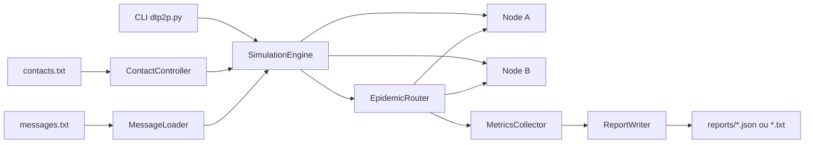
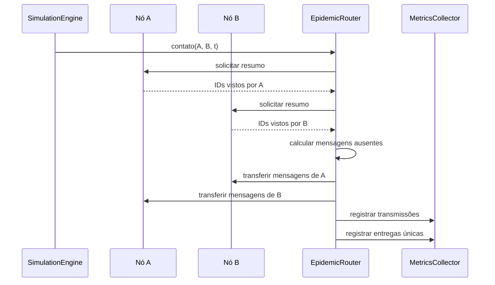
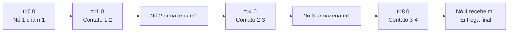
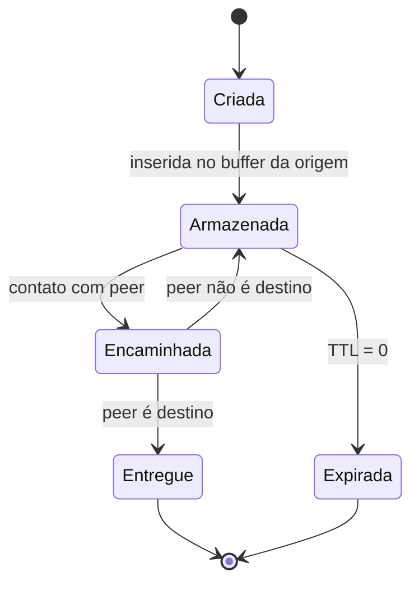
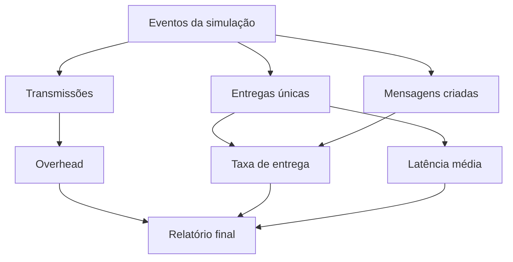

# Diagramas

## Visão de Componentes

```mermaid
flowchart LR
    CLI["CLI dtp2p.py"] --> Engine["SimulationEngine"]
    Contacts["contacts.txt"] --> ContactController["ContactController"]
    Messages["messages.txt"] --> MessageLoader["MessageLoader"]
    ContactController --> Engine
    MessageLoader --> Engine
    Engine --> NodeA["Node A"]
    Engine --> NodeB["Node B"]
    Engine --> Router["EpidemicRouter"]
    Router --> NodeA
    Router --> NodeB
    Router --> Metrics["MetricsCollector"]
    Metrics --> Report["ReportWriter"]
    Report --> Output["reports/*.json ou *.txt"]
```

## Fluxo de Contato P2P

```mermaid
sequenceDiagram
    participant S as SimulationEngine
    participant A as Nó A
    participant B as Nó B
    participant R as EpidemicRouter
    participant M as MetricsCollector

    S->>R: contato(A, B, t)
    R->>A: solicitar resumo
    A-->>R: IDs vistos por A
    R->>B: solicitar resumo
    B-->>R: IDs vistos por B
    R->>R: calcular mensagens ausentes
    R->>B: transferir mensagens de A
    R->>A: transferir mensagens de B
    R->>M: registrar transmissões
    R->>M: registrar entregas únicas
```

## Store-and-Forward em Cadeia

```mermaid
flowchart LR
    T0["t=0.0\nNó 1 cria m1"] --> C12["t=1.0\nContato 1-2"]
    C12 --> B2["Nó 2 armazena m1"]
    B2 --> C23["t=4.0\nContato 2-3"]
    C23 --> B3["Nó 3 armazena m1"]
    B3 --> C34["t=8.0\nContato 3-4"]
    C34 --> D4["Nó 4 recebe m1\nEntrega final"]
```

## Estados de Uma Mensagem

```mermaid
stateDiagram-v2
    [*] --> Criada
    Criada --> Armazenada: inserida no buffer da origem
    Armazenada --> Encaminhada: contato com peer
    Encaminhada --> Armazenada: peer não é destino
    Encaminhada --> Entregue: peer é destino
    Armazenada --> Expirada: TTL = 0
    Entregue --> [*]
    Expirada --> [*]
```

## Pipeline de Métricas

```mermaid
flowchart TD
    Events["Eventos da simulação"] --> Transmissions["Transmissões"]
    Events --> Deliveries["Entregas únicas"]
    Events --> Created["Mensagens criadas"]
    Transmissions --> Overhead["Overhead"]
    Deliveries --> DeliveryRate["Taxa de entrega"]
    Deliveries --> Latency["Latência média"]
    Created --> DeliveryRate
    Overhead --> Report["Relatório final"]
    DeliveryRate --> Report
    Latency --> Report
```

